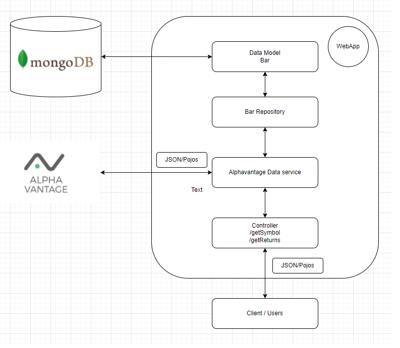

# Java WebApp project

This microservice project make use of finance data api to generate financial metrics. Financial data provider is [Alphavantage]('https://www.alphavantage.co/'). 

## 1. Installation

### Step 1: Install Docker

Please install docker for your own OS and execute the following command to create network bridge

```bash
docker network create -d bridge mongo-network            # create bridge for containers
docker network ls                                        # view bridge network
```

Create mongodb container and database setting
```bash
docker run -p 127.0.0.1:27017:27017 --network mongo-network --name mongo_db -d mongo
                                                         # create container with mongodb image
```

Now your mongodb container is named as "mongo_db". Execute the following command in mongodb console
```
use admin;

db.createUser({
    user: "rootuser",
    pwd: "rootpass",
    roles: [{ role: "userAdminAnyDatabase", db: "admin" }]
});                                                      # create admin user

db.auth("rootuser", "rootpass");                         # verify user
```

Create mongo-express container (optional)
```bash
docker run --name mongo_express --network mongo-network -e ME_CONFIG_MONGODB_SERVER=mongo_db
  -e ME_CONFIG_MONGODB_ADMINUSERNAME=rootuser -e ME_CONFIG_MONGODB_ADMINPASSWORD=rootpass
  -p 127.0.0.1:8081:8081 -d mongo-express:latest         # create container with mongo-express image
```

### Step 2: Build Docker Image and container with configuration

Using the following command to build the docker image
```bash
docker build -t [image name] .                           # create container with mongo-express image
docker build -t javawebapp .                             # use javawebapp as image name
```

Create a container with the build java image
```bash
docker run -p 127.0.0.1:9000:9000 --network mongo-network --name [java app container name]
-d [image name] --dns 1.1.1.1 --server.port=[your port] --spring.data.mongodb.host=[db host name]
docker run -p 127.0.0.1:9000:9000 --network mongo-network --name javaapp
-d javawebapp --dns 1.1.1.1 --server.port=9000
--spring.data.mongodb.host=mongo_db                      # example
```

Please test the webapp via [localhost:9000//api/test]('localhost:9000//api/test') 

## 2. Usage

### I. Symbol Search (/api/getSymbol)
param1: keyword (string)

#### Search Endpoint from Alphavantage

example: http://localhost:9000/api/getSymbol?keyword=apple

Here is the JSON output
```json
[
  {
    "1. symbol":"APLE",
    "2. name":"Apple Hospitality REIT Inc",
    "3. type":"Equity",
    "4. region":"United States",
    "5. marketOpen":"09:30",
    "6. marketClose":"16:00",
    "7. timezone":"UTC-04",
    "8. currency":"USD",
    "9. matchScore":"0.8889"
  },
  {
    "1. symbol":"AAPL",
    "2. name":"Apple Inc",
    "3. type":"Equity",
    "4. region":"United States",
    "5. marketOpen":"09:30",
    "6. marketClose":"16:00",
    "7. timezone":"UTC-04",
    "8. currency":"USD",
    "9. matchScore":"0.7143"
  }, ...
]
```

### II. Annualized Return (/api/getReturns)
param1: symbol (string)

param2: from (date [format yymmdddd])

param3: to (date [format yymmdddd])

#### Calculate annualized return given symbol, start date and end date

example 1 : http://localhost:9000/api/getReturns?symbol=AAPL&from=20210101&to=20220301

Here is the JSON output
```json
{
  "status":"Succeed",
  "message":null,
  "financialMetric":
  {
    "symbol":"AAPL",
    "annualizedReturn":0.22278635497482036,
    "dateFrom":"2021-01-04",
    "dateTo":"2022-03-01",
    "closePriceFrom":129.4100,
    "closePriceTo":163.2000
  }
}
```
Here is another example with an unknown symbol
example 2 : http://localhost:9000/api/getReturns?symbol=UNKNOWN&from=20220301&to=20220309

```json
{
  "status":"Failed",
  "message":"Unknown symbol input: UNKNOWN, please use /symbolSearch to find correct symbol",
  "financialMetric":null
}
```

## 3. Test Case

### I) Symbol search

|Test Case Description|Expected Result|
|----|----|
|Use keyword 'apple' in symbolSearch function|returning non null results|
|Use keyword '^hfyg*' in symbolSearch function|returning error|

### II) Annualized Return

#### i) testing annualized return formula

|Test Case Description|Expected Result|
|----|----|
|Testing the annualized return formula with different sets of values|Correct results|
|Testing the annualized return formula with date is null or close price is null|Execption raised|

#### i) testing data retrieved from database given from and to date 

|Test Case Description|Expected Result|
|----|----|
|Test annualized return with correct symbol and exact bar date|calculated with bars of exact date|
|Test annualized return with wrong symbol|Execption raised|
|Test annualized return with correct symbol and from date is hoilday|calculated with bar of from date calibrated to inclusive nearest business date|
|Test annualized return with correct symbol and to date is hoilday|calculated with bar of to date calibrated to inclusive nearest business date|
|Test annualized return with correct symbol and both date are hoilday|calculated with both bars calibrated to inclusive nearest business date|
|Test annualized return with correct symbol and both date are out of time range|calculated with both bars calibrated to inclusive nearest business date|

All results can be obtained by running the designed test case class in JavawebappApplicationTests.java

## 4. Software Design



### I) Database and Model layer

The data model is quite simple for this microservice. Only one collection is created for storing stock data. The reason
for choosing mongoDB instead of other relational database is for faster read and write. For handling huge amount of
financial data, mongoDB is also a good choices.

### II) Repository layer

Repository layer stores set of database operation(CRUD) with respect to data model. While service layer run
the business logic, repository layer can perform the corresponding operation serves what the service needs. 

### III) Service layer

In the service layer, it handles all the request from controller like request data from Alphavantage data api,
financial computation and managing database operations. Different class are implemented like http request handler and
Pojos for communication bewteen the app, Alphavantage api and client request. Financial metrics are also defined in this
layer.

### IV) Controller

Clients or users can directly send out http request (symbol search or financial metric calculation) with controllers 

## 5. Enhancement in the future

### I) Use of scheduler

Since the free Alphavantage API has request limits (only 5 API requests per minute and 500 requests per day). New add-ons
are suggested like job-based scheduler. It can use up all the API requests till near the end of the day. Much data can
be collected for long term usage. 

### II) Adding handler with data of different time zone

Data come from different exchanges should be calibrate with different time zones. The handler should be implemented.

## 6. Personal comment

It is a meaningful project not only act as a self assessment but also a learning sprint for me. Many important concepts
like software design pattern, library and tools selection can be revised during the project. It brings me a lot of ideas
for upgrading my own trading assistant and I enjoy it very much.